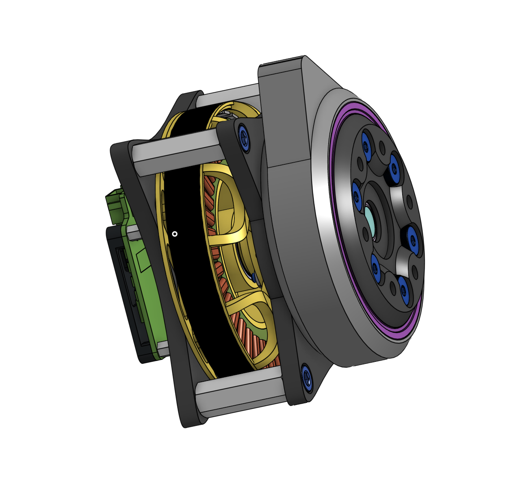
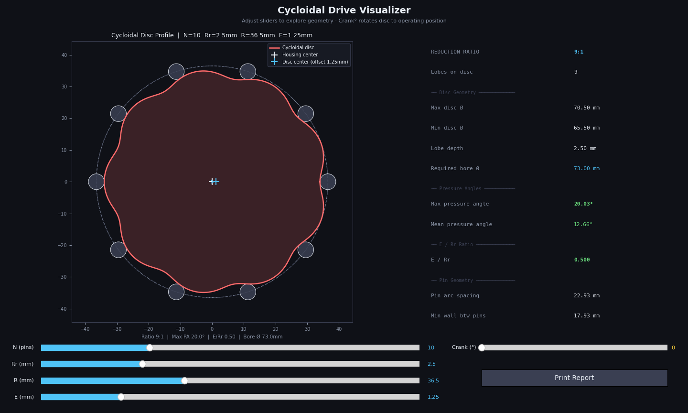
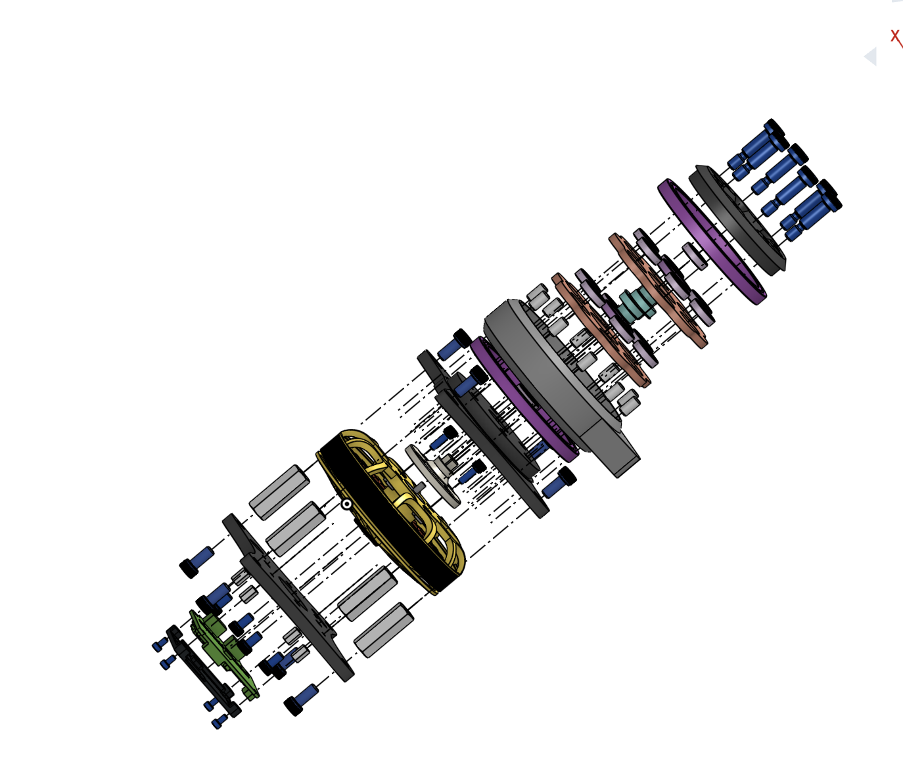

# BLDC Cycloidal Actuator - Quadruped Robot Leg

A custom cycloidal gearbox and actuator designed for a quadruped robot. Built around an 8308 BLDC motor with ~9:1 reduction ratio.

## Overview
- **Reduction ratio:** ~9:1 cycloidal gearbox
- **Motor:** 8308 BLDC
- **Controller:** Moteus r4.11 via CAN bus
- **Construction:** FDM Printed in PLA+ on Bambu Lab A1 Mini

## Status
- [x] Cycloidal disc design
- [x] Gearbox housing design
- [x] Wiring schematic
- [x] BOM
- [ ] 3D Printed Protoype
- [ ] Full 3DOF Leg Design

## Cycloidal Disc Design
- **E / Rr:** 0.500
- **Max Pressure Angle:** 20.03 degrees

See [cycloidal_dirive_visualizer/cycloidal_drive_visualizer.py](cycloidal_drive_visualizer/cycloidal_drive_visualizer.py)

## CAD
All CAD designed in OnShape.
[View OnShape Document](https://cad.onshape.com/documents/7e181885841e2c0563f5ea8b/w/eb359d6e40468758aae61fb6/e/6c3a266b2d21d51902da69a4?renderMode=0&uiState=6a44a79b4963b5aa094522b4)

## BOM
See [BOM/cycloidal_actuator_BOM.xlsx](BOM/cycloidal_actuator_BOM.xlsx)

## Wiring Schematic
Inputs are sent through Teensy4.1 via CAN bus communication.

See [kicad-schematic/Teensy_BLDC_Build/Teensy_BLDC_Buld.kicad_sch](kicad-schematic/Teensy_BLDC_Build/Teensy_BLDC_Build.kicad_sch)