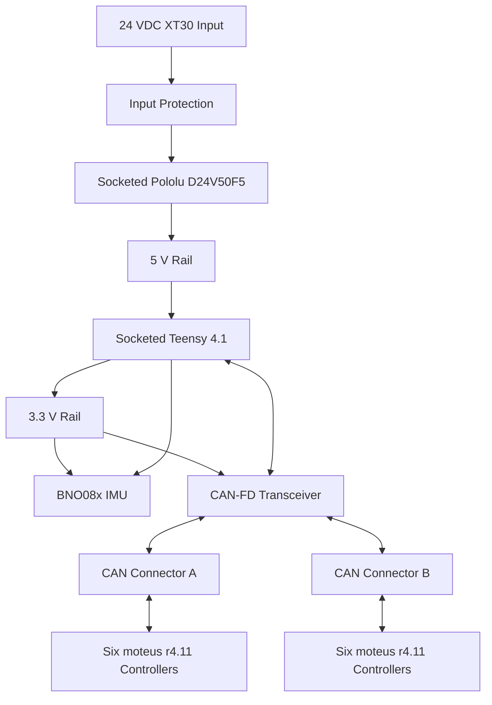

# PCB Learnings:

The Teensy 4.1 is socketed, must preserve USB access, and avoid unsade USB/VIN back-power paths

Prefer the simplest physcically linear bus topology that matches the electrical constraints; adding more branches can make the system 
look simpler mechanically but usually hurts signal integrity and makes termination harder.

Mount the IMU rigidly on the PCB rather than making it removable, because mechanical rigidity improves motion measurement consistency 
and avoids extra cost and height.

Prefer removable, socketed mounting for high-value modules, but keep low-cost, vibration-sensitive signal parts permanently soldered 
for better reliability and measurement stability.

Prefer socketed or high-retention mounting for removable regulator modules over loose jumper-wire connections, 
because jumpers add failure points in vibrating systems.

For robot hubs that need orientation data, 
a fused IMU with onboard sensor fusion is often the cleaner choice than raw inertial sensing plus host-side fusion.

Verify the physical-layer transceiver is CAN-FD rated before committing to the design; 
classic CAN transceivers are not suitable for the higher data-phase bitrate.

For a central-hub robot, it is often cleaner to treat the hub as a passive CAN junction and keep motor power distribution on a separate board, 
so the communication board only has to handle logic, transceivers, and low-power peripherals.

A linear daisy-chain CAN-FD bus with short stubs and end-only termination 
can still be practical over roughly 4.5 m for a small multi-node robot.

If the processor only has one CAN-FD-capable controller, 
two independent CAN-FD buses may require an external CAN-FD controller or a different MCU architecture.

Classic CAN transceivers are not suitable for CAN-FD data-phase rates;
the CAN physical layer choice must be checked against the actual bus protocol requirements, not just the arbitration bitrate.

# Project Specification

## Project Overview
- Teensy 4.1 carrier and central control hub for a quadruped robot.
- Accepts 24 VDC and provides local 5 V power through a removable Pololu D24V50F5 module.
- Interfaces one Teensy 4.1 CAN-FD controller to twelve moteus r4.11 motor controllers on one linear CAN-FD bus.
- Includes a permanently assembled fused 9-DoF IMU.

## Intended Use
- Prototype and robot-development platform mounted near the center of a quadruped.
- Initial use may test one three-motor leg; the completed wiring supports all four legs.
- Expected CAN cable length is approximately 4.5 m end-to-end in the complete robot.

## What the Device Should Do
- Power a socketed Teensy 4.1 from a 24 V robot supply.
- Communicate with up to twelve moteus r4.11 FOC controllers.
- Acquire fused orientation and motion data.
- Permit rapid replacement of the Teensy and DC-DC module.
- Provide accessible test points and mechanically secure robot-ready connections.

## Main Features
- XT30 24 VDC input used only by the hub.
- Socketed Pololu D24V50F5 5 V regulator module.
- Socketed Teensy 4.1.
- One MCP2562FD-class CAN-FD transceiver with 3.3 V VIO and at least 5 Mbit/s capability.
- Two JST-PH 3-pin CAN connectors: CANH, CANL, GND.
- BNO085/BNO086-class IMU using SPI.
- Input protection, local decoupling, status indication, and test access.
- Four M2.5 corner mounting holes.

## System Architecture

## Hardware Subsystems
### Power
- XT30 input, nominal 24 VDC.
- Add reverse-polarity and transient protection appropriate for wiring in a motorized robot.
- Pololu D24V50F5 remains removable through high-retention socket headers and mechanical support provisions.
- Teensy VIN receives regulated 5 V; do not connect an external 5 V source simultaneously without respecting Teensy power-input constraints.

### Compute
- Teensy 4.1 on removable female socket headers.
- Use the Teensy CAN3/CAN-FD-capable interface.
- Preserve USB connector access, reset/program access, and SD-card access where practical.

### CAN-FD
- One physical bus at 1 Mbit/s arbitration and 5 Mbit/s data phase.
- Two connectors represent the two physical directions of one linear bus, not independent channels.
- No onboard 120 ohm termination in the default design. Termination belongs at the two physical ends; the user has external JST-PH terminator boards for reduced configurations.
- CANH/CANL routing must be short, symmetric, and treated as a controlled differential pair.
- Add CAN-line ESD protection with low capacitance suitable for CAN-FD.

### IMU
- Permanently assembled BNO085/BNO086-class fused IMU.
- SPI interface preferred for reliable higher-rate communication.
- Mount near the board center, rigidly, with clear axis markings.
- Keep away from the switching regulator, high-current paths, and magnetic materials where possible.

## Interfaces and Connections
| Interface | Connector or Device | Signals |
|---|---|---|
| Power input | XT30 | +24V, GND |
| CAN direction A | JST-PH 3-pin | CANH, CANL, GND |
| CAN direction B | JST-PH 3-pin | CANH, CANL, GND |
| Host compute | Teensy 4.1 sockets | 5V, 3.3V, GND, CAN TX/RX, SPI, interrupt/reset signals |
| Regulator | Pololu D24V50F5 sockets | VIN, GND, VOUT and applicable control pins |
| Debug/test | Test points | 24V, 5V, 3.3V, GND, CANH, CANL, CAN TX, CAN RX, SPI CS/IRQ |

## Power and Runtime Expectations
- The hub does not distribute motor power.
- Continuous power is expected to remain well below the Pololu module's 5 A rating.
- Design for at least 0.75 A available on the 5 V rail to cover Teensy activity, USB peripherals, CAN dominant-state current, IMU, indicators, and margin.

## Power Tree and Power Budget
| Rail | Load | Estimated Typical | Design Peak |
|---|---|---:|---:|
| 5 V | Teensy 4.1 and attached local functions | 150-250 mA | 500 mA |
| 5 V | CAN-FD transceiver bus supply | 10-40 mA | 80 mA |
| 3.3 V | BNO08x IMU | 5-15 mA | 25 mA |
| 3.3/5 V | LEDs and support circuitry | 5-15 mA | 30 mA |
| 5 V total | All hub loads plus margin | about 300 mA | 750 mA design target |

At 24 V and 90 percent conversion efficiency, a 0.75 A peak at 5 V corresponds to approximately 0.174 A from the 24 V input. Protection and connectors should be sized above this with transient margin. Final values must be checked against selected part datasheets and any later Teensy USB/peripheral loading.

## Manufacturing and Assembly Expectations
- Four-layer PCB preferred for solid ground/reference planes and robust CAN-FD routing.
- Manufacturer assembles all SMD parts, connectors, protection, and IMU.
- Teensy and Pololu modules remain removable and may be installed after PCBA delivery.
- Choose commonly stocked, non-obsolete parts where possible.
- Include fiducials, readable polarity and pin-1 markings, connector pin labels, IMU axes, and board revision marking.

## Firmware-Relevant Hardware Requirements
- Teensy 4.1 CAN3 configured for CAN-FD, 1 Mbit/s nominal and 5 Mbit/s data rate.
- SPI interface to BNO08x with dedicated chip-select, interrupt, and reset as required.
- Maintain access to Teensy USB programming and program/reset controls.
- Firmware must support operation with one to twelve moteus nodes and report CAN errors.

## Physical Design Expectations
- Compact rectangular board sized after footprint and connector placement.
- Four M2.5 clearance mounting holes at the corners.
- XT30 and CAN connectors accessible from board edges.
- Teensy USB connector accessible at an edge.
- IMU close to mechanical center with axis legend on silkscreen.
- Provide mechanical support/retention provisions for both removable modules.

## Important Design Decisions
- One shared linear CAN-FD bus was selected because Teensy 4.1 exposes one CAN-FD-capable controller.
- Two CAN connectors represent opposite directions of the bus; each direction daisy-chains through six moteus controllers.
- MCP2562FD-class transceiver selected over SN65HVD230 because SN65HVD230 is unsuitable for the 5 Mbit/s CAN-FD data phase.
- Teensy and Pololu modules are removable; IMU and CAN interface are permanently assembled for signal integrity and mechanical stability.
- No onboard termination; external termination is placed at actual bus ends.

## Assumptions
- The complete cable assembly is a true linear trunk with very short moteus stubs.
- The robot supply can experience motor-related transients; input protection will be included even though motor power is routed elsewhere.
- JST-PH cable pin order will be fixed consistently as CANH, CANL, GND and clearly marked.
- Environmental target is indoor prototype robotics rather than sealed outdoor deployment.
